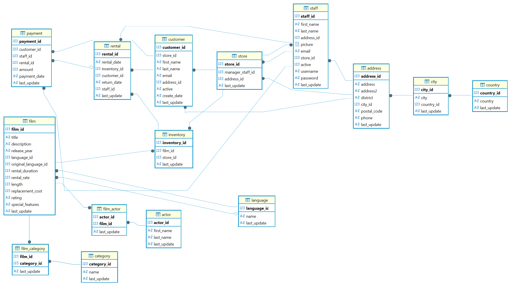
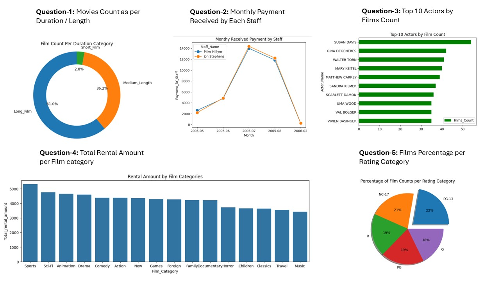

# SQL Python Sakila DVD Store Rental Dataset Analysis

The Sakila database is a fictional, normalized database schema from MySQL that models a real-world DVD rental store, containing tables for films, actors, customers, rentals, inventory, and payments, serving as a standard, open-source dataset for learning SQL, database design, and practicing complex queries and data analysis. It's widely used for study purpose to sharpen the SQL skills like joins, sub-queries, and data visualization for understanding business metrics.

# Sakila DB Schema

Sakila renteal DB contains multiple related tables. Below is the brief description about the tables and Schema 

- actor: Lists information for all actors, linked to films through film_actor.
- address: Contains address details for customers, staff, and stores, linked to city.
- category: A lookup table for film categories, linked to films through film_category.
- customer: Contains customer information, linked to store, address, rental, and payment tables.
- film: A list of all films, with details like title, description, and language. It is linked to language, film_actor, film_category, and inventory tables.
- film_actor: A junction table supporting the many-to-many relationship between film and actor.
- film_category: A junction table supporting the many-to-many relationship between film and category.
- inventory: Contains one row for each physical copy of a film in a specific store, linking film and store and referred to by rental.
- language: A lookup table for film languages.
- payment: Records each customer payment, linking to customer, rental, and staff tables.
- rental: Records each inventory rental transaction (who rented what and when), linking to inventory, customer, and staff tables.
- staff: Lists all staff members, linked to store and address tables.
- store: Contains store information (e.g., location, manager), linked to address and staff

# Questions used in SQL Analysis
In this task below five questions are answered using SQL queries from basic to advance level. Then Python Visualization is build to depict the results.

- 1: Movies Count as per Duration / Length
- 2: Monthly Payment Received by Each Staff
- 3: Top 10 Actors by Films Count
- 4: Total Rental Amount per Film category
- 5: Films Percentage Count per Rating Categort

# Python Visualization
The SQLite DB is handled in python to fetch data using SQL queries then the Visualizations are build using different plots like matplotlib and seaborn. Below are the Visualizations created for each question. the SQL script is available in the repository.

